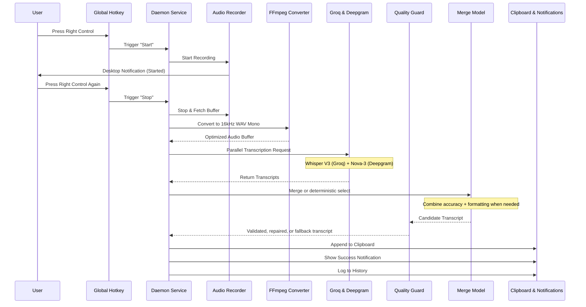

# Transcription Data Flow (STT Flow)

This document details the complete path from a user's voice input to the final text in their clipboard. `hyprvox` optimizes for speed, accuracy, and reliability by using a multi-service parallel approach combined with an LLM-based merger.

## Flow Diagram

## Step-by-Step Breakdown

### 1. Trigger (Global Hotkey)
- **Library**: `node-global-key-listener`.
- **Key**: Default is `Right Control`.
- **Behavior**: Toggle mode. The first press starts the recording; the second press stops it.
- **Verification**: Checks for hotkey conflicts at startup.

### 2. Audio Capture
- **Utility**: `arecord` (via `node-record-lpcm16`).
- **Configuration**:
  - Sample Rate: 16,000 Hz
  - Channels: 1 (Mono)
  - Format: WAV (LPCM 16-bit)
- **Safety Limits**:
  - **Min Duration**: 0.6 seconds (rejects accidental triggers).
  - **Max Duration**: 5 minutes (auto-stops to prevent runaway resource usage).
  - **Warning**: Desktop notifications at 4:00 and 4:30 minutes.
  - **Silence Detection**: Warns the user if the recorded audio contains no detectable speech (RMS threshold).

### 3. Pre-processing
- **Utility**: `ffmpeg`.
- **Purpose**: Normalizes the audio buffer to ensure strict compatibility with external APIs.
- **Specs**: 16kHz, Mono, PCM 16-bit Little Endian.

### 4. Parallel Transcription
To minimize latency and maximize accuracy, `hyprvox` executes requests to two separate providers simultaneously using `Promise.all`:

Before provider calls, the daemon builds technical-term hints from configured boost words, common technical terms, and repo filenames. Configured boost words are preserved for provider hints, while a smaller computed project lexicon is cached for merge-context hints. This improves exact tokens such as `AGENTS.md`, `CRUD`, `SSE`, and `CodeRabbit`.

1.  **Groq (Whisper Large V3)**:
    - **Strength**: Unrivaled technical accuracy and word recognition.
    - **Usage**: Primary source for content.
2.  **Deepgram (Nova-3)**:
    - **Strength**: Exceptional punctuation, capitalization, and formatting.
    - **Usage**: Primary source for structure.

**Fallback Logic**: If one service fails, the daemon automatically uses the result from the successful one. If both fail, a critical error notification is shown. Merge calls can also use `apiKeys.groqFallback` only when the primary Groq merge key hits rate/quota limits.

**Technical Term Preservation**: Groq always receives provider boost terms as prompt hints. Deepgram receives those terms as `keyterm` hints when `transcription.deepgramBoosting` is enabled. The merge prompt receives the capped project lexicon plus exact tokens found in either source transcript.

**Replay Logging**: The daemon also logs the raw Groq source transcript at info level so merge-quality experiments can replay exact source pairs later.

**Deepgram Finalization Metrics**: In streaming mode, each session records `deepgramFinalizeWaitMs`, `deepgramCloseWaitMs`, `deepgramEndpointingMs`, `deepgramReceivedFinalChunk`, and `deepgramHadSpeechFinal`. These explain whether stop latency came from waiting for the final transcript, closing the WebSocket, or missing Deepgram finalization signals.

### 5. Merge And Quality Pipeline
If both Groq and Deepgram return results, Hyprvox first decides whether deterministic selection is enough or whether an LLM merge is needed. The merge model is configured by `transcription.mergeModel`.

- **Prompting**: When an LLM merge is needed, the model is instructed to trust Groq for words/technical terms and Deepgram for punctuation/formatting.
- **Lexicon Hints**: The merge prompt includes known project terms and exact tokens found in either source transcript.
- **Formatting Mode**: `transcription.formattingMode` controls whether the merge stays close to spoken prose (`verbatim`), lightly cleans sentence boundaries (`clean`), or formats clearly dictated multi-item speech as lists (`structured`).
- **Validation**: Candidate output is checked for prompt artifacts, CoT/meta leakage, injected filename/command token bursts, detachable hallucination suffixes, mixed-script garbage in English mode, and obvious garbage fragments.
- **Repair**: If a merged output fails validation and both source transcripts exist, Hyprvox retries the merge once with a stricter repair prompt.
- **Source Fallback**: If repair fails, Hyprvox chooses a clean source transcript instead of saving unsafe merged text.
- **Long Recording Guard**: For recordings over 90 seconds or transcripts over 150 words, Hyprvox flags merge outputs that expand far beyond both source transcripts and falls back to the longest valid source transcript instead of saving likely invented bridge text.
- **Fallback**: If the LLM call fails or times out, the system defaults to source fallback behavior rather than blocking a clean transcript.

Current rollout note: endpoint tuning is intentionally paused after adding Deepgram finalization metrics. Collect fresh usage data before changing `endpointing` or finalize timeout behavior.

### 6. Output Generation
The final text follows three paths:

1.  **Clipboard (Critical)**:
    - **Action**: **APPEND** to current clipboard history.
    - **Wayland**: Uses `wl-copy`.
    - **X11**: Uses `clipboardy`.
    - **Resilience**: Never overwrites user's existing clipboard content.
2.  **Notification**:
    - **Action**: Desktop notification via `libnotify` (`notify-send`).
    - **Content**: Summary of success or detailed error message.
3.  **History**:
    - **Location**: `~/.config/hypr/vox/history.json`.
    - **Metadata**: Stores timestamp, text, duration, engine used, and processing time.

## Performance Metrics
- **Avg. Time to Clipboard**: 1.2s - 2.5s (depending on audio length).
- **Audio processing overhead**: <100ms.
- **LLM Merging overhead**: skipped on deterministic paths; otherwise model-dependent.
- **Deepgram stop metrics**: streaming sessions log finalize wait, close wait, endpointing, final chunk, and speech-final signals.
